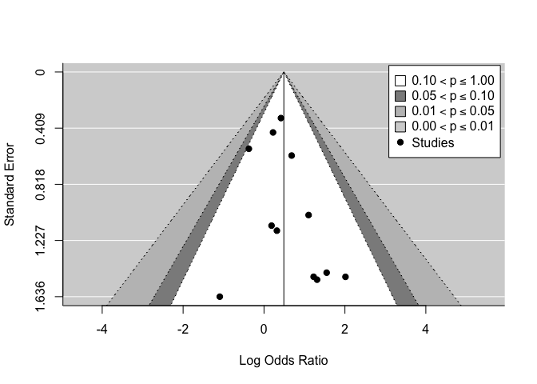

Antidepressants and suicidal behaviour?
================
Jakob A. Kaminski
4 7 2019

## Intro

In 1990 Teicher et al. (1990) reported unexpected suicidal ideation in
depressed patients treated with fluoxetine. Since then, several studies
investigated suicide risk. A recent study by Hengartner et al. (2018)
performed a re-analysis of the FDA database and evaluated
newer-generation antidepressants and suicide risk in Randomized
Controlled Trials.

They refer to Khan et al 2018 who report decreased suicidylity in newer
generation antidepressants and no decreased suicidality as compared to
placebo.

Khan et al. calculate person person exposure year (PEY).

Hengartner et al. argue that suicides occur in the beginning of
treatment so PEY is not the apropriate analysis.

We critically review the literature and reanalyze the re-analysis.

This is the data from Hengartner et al. (2018) Of note, there is
considerable variance between the studies.

<table>

<thead>

<tr>

<th style="text-align:left;">

study

</th>

<th style="text-align:right;">

ADsuicides

</th>

<th style="text-align:right;">

ADparticipants

</th>

<th style="text-align:right;">

PLCsuicides

</th>

<th style="text-align:right;">

PLCparticipants

</th>

</tr>

</thead>

<tbody>

<tr>

<td style="text-align:left;">

Sertraline (1991)

</td>

<td style="text-align:right;">

2

</td>

<td style="text-align:right;">

2053

</td>

<td style="text-align:right;">

0

</td>

<td style="text-align:right;">

786

</td>

</tr>

<tr>

<td style="text-align:left;">

Paroxetine (1992)

</td>

<td style="text-align:right;">

5

</td>

<td style="text-align:right;">

2963

</td>

<td style="text-align:right;">

2

</td>

<td style="text-align:right;">

554

</td>

</tr>

<tr>

<td style="text-align:left;">

Venlafaxine (1993)

</td>

<td style="text-align:right;">

3

</td>

<td style="text-align:right;">

2181

</td>

<td style="text-align:right;">

1

</td>

<td style="text-align:right;">

451

</td>

</tr>

<tr>

<td style="text-align:left;">

Nefazodone (1994)

</td>

<td style="text-align:right;">

9

</td>

<td style="text-align:right;">

3496

</td>

<td style="text-align:right;">

0

</td>

<td style="text-align:right;">

875

</td>

</tr>

<tr>

<td style="text-align:left;">

Mirtazapine (1996)

</td>

<td style="text-align:right;">

8

</td>

<td style="text-align:right;">

2425

</td>

<td style="text-align:right;">

0

</td>

<td style="text-align:right;">

494

</td>

</tr>

<tr>

<td style="text-align:left;">

Venlafaxine ER (1997)

</td>

<td style="text-align:right;">

1

</td>

<td style="text-align:right;">

705

</td>

<td style="text-align:right;">

0

</td>

<td style="text-align:right;">

285

</td>

</tr>

<tr>

<td style="text-align:left;">

Citalopram (1998)

</td>

<td style="text-align:right;">

8

</td>

<td style="text-align:right;">

4168

</td>

<td style="text-align:right;">

1

</td>

<td style="text-align:right;">

691

</td>

</tr>

<tr>

<td style="text-align:left;">

Escitalopram (2002)

</td>

<td style="text-align:right;">

0

</td>

<td style="text-align:right;">

715

</td>

<td style="text-align:right;">

0

</td>

<td style="text-align:right;">

592

</td>

</tr>

<tr>

<td style="text-align:left;">

Duloxetine (2002)

</td>

<td style="text-align:right;">

0

</td>

<td style="text-align:right;">

2314

</td>

<td style="text-align:right;">

0

</td>

<td style="text-align:right;">

723

</td>

</tr>

<tr>

<td style="text-align:left;">

Desvenlafaxine (2008)

</td>

<td style="text-align:right;">

1

</td>

<td style="text-align:right;">

2667

</td>

<td style="text-align:right;">

0

</td>

<td style="text-align:right;">

803

</td>

</tr>

<tr>

<td style="text-align:left;">

Trazodone ER (2010)

</td>

<td style="text-align:right;">

0

</td>

<td style="text-align:right;">

202

</td>

<td style="text-align:right;">

0

</td>

<td style="text-align:right;">

204

</td>

</tr>

<tr>

<td style="text-align:left;">

Vilazodone (2011)

</td>

<td style="text-align:right;">

0

</td>

<td style="text-align:right;">

2177

</td>

<td style="text-align:right;">

0

</td>

<td style="text-align:right;">

997

</td>

</tr>

<tr>

<td style="text-align:left;">

Levomilnacipran (2013)

</td>

<td style="text-align:right;">

0

</td>

<td style="text-align:right;">

2655

</td>

<td style="text-align:right;">

0

</td>

<td style="text-align:right;">

1004

</td>

</tr>

<tr>

<td style="text-align:left;">

Vortioxetine (2013)

</td>

<td style="text-align:right;">

0

</td>

<td style="text-align:right;">

3060

</td>

<td style="text-align:right;">

0

</td>

<td style="text-align:right;">

1621

</td>

</tr>

</tbody>

</table>

The analysis is run on the sum of the above mentioned data:

<table>

<thead>

<tr>

<th style="text-align:left;">

</th>

<th style="text-align:right;">

Placebo

</th>

<th style="text-align:right;">

Antidepressant

</th>

</tr>

</thead>

<tbody>

<tr>

<td style="text-align:left;">

no suicide

</td>

<td style="text-align:right;">

10076

</td>

<td style="text-align:right;">

31744

</td>

</tr>

<tr>

<td style="text-align:left;">

suicide

</td>

<td style="text-align:right;">

4

</td>

<td style="text-align:right;">

37

</td>

</tr>

</tbody>

</table>

## Reproducing Hengartner et al. results

    ## $tab
    ##            Placebo           p0 Antidepressant          p1 oddsratio
    ## no suicide   10076 0.9996031746          31744 0.998835782   1.00000
    ## suicide          4 0.0003968254             37 0.001164218   2.83487
    ##               lower    upper    p.value
    ## no suicide       NA       NA         NA
    ## suicide    1.133143 9.671619 0.02354558
    ## 
    ## $measure
    ## [1] "midp"
    ## 
    ## $conf.level
    ## [1] 0.95
    ## 
    ## $pvalue
    ## [1] "midp.exact"
    ## 
    ## $x
    ##            Placebo Antidepressant
    ## no suicide   10076          31744
    ## suicide          4             37
    ## 
    ## $data
    ##            Placebo Antidepressant Total
    ## no suicide   10076          31744 41820
    ## suicide          4             37    41
    ## Total        10080          31781 41861
    ## 
    ## $p.exposed
    ##                 Placebo Antidepressant        Total
    ## no suicide 0.9996031746    0.998835782 0.9990205681
    ## suicide    0.0003968254    0.001164218 0.0009794319
    ## Total      1.0000000000    1.000000000 1.0000000000
    ## 
    ## $p.outcome
    ##               Placebo Antidepressant Total
    ## no suicide 0.24093735      0.7590626     1
    ## suicide    0.09756098      0.9024390     1
    ## Total      0.24079692      0.7592031     1
    ## 
    ## $p.value
    ##             NA
    ## two-sided    midp.exact fisher.exact chi.square
    ##   no suicide         NA           NA         NA
    ##   suicide    0.02354558   0.02855102 0.04960071
    ## 
    ## $correction
    ## [1] TRUE

First one has to visualize the data.

## Mosaic plot

<!-- -->

Then we reanalyzed the data using meta analytical approach taking the
variance between studies into account peto method
<http://www.metafor-project.org/doku.php/analyses:yusuf1985>

### suicide

<!-- -->

### suicide attempts

<!-- --><!-- -->

### suicide

Mantel-Haenszel (MH) Methode. Reccomended for rare events, and anequal
group sizes: Ref:
<https://ebmh.bmj.com/content/21/2/72>

<!-- -->

    ## 
    ## Fixed-Effects Model (k = 14)
    ## 
    ## Test for Heterogeneity: 
    ## Q(df = 7) = 4.9623, p-val = 0.6646
    ## 
    ## Model Results (log scale):
    ## 
    ## estimate      se    zval    pval    ci.lb   ci.ub 
    ##   0.6828  0.5211  1.3103  0.1901  -0.3386  1.7042 
    ## 
    ## Model Results (OR scale):
    ## 
    ## estimate   ci.lb   ci.ub 
    ##   1.9794  0.7128  5.4968 
    ## 
    ## Cochran-Mantel-Haenszel Test:    CMH = 1.8312, df = 1, p-val = 0.1760
    ## Tarone's Test for Heterogeneity: X^2 = 7.5084, df = 7, p-val = 0.3779

### suicide attempts

<!-- -->

    ## 
    ## Fixed-Effects Model (k = 12)
    ## 
    ## Test for Heterogeneity: 
    ## Q(df = 11) = 6.3883, p-val = 0.8462
    ## 
    ## Model Results (log scale):
    ## 
    ## estimate      se    zval    pval   ci.lb   ci.ub 
    ##   0.4901  0.2038  2.4053  0.0162  0.0907  0.8895 
    ## 
    ## Model Results (OR scale):
    ## 
    ## estimate   ci.lb   ci.ub 
    ##   1.6325  1.0950  2.4340 
    ## 
    ## Cochran-Mantel-Haenszel Test:    CMH =  5.9428, df = 1,  p-val = 0.0148
    ## Tarone's Test for Heterogeneity: X^2 = 10.4092, df = 11, p-val = 0.4940

<!-- -->

calculating NNH with
<https://ebm-tools.knowledgetranslation.net/calculator/converter/>

patient expected event rate of 3.7% according to

<https://www.cdc.gov/mmwr/preview/mmwrhtml/ss6013a1.htm>

NNH=45

Or from risk difference according to
<https://handbook-5-1.cochrane.org/chapter_12/12_5_4_1_computing_nnt_from_a_risk_difference_rd.htm>

``` r
res <-rma.mh(df$suica_ad, df$part_ad-df$suica_ad, 
       df$suica_plc, df$part_plc-df$suica_plc, 
       df$part_ad, df$part_plc,
       to="only0", drop00=FALSE, add=1/2,
       level=95, verbose=FALSE, measure="RD", correct = FALSE)
res
```

    ## 
    ## Fixed-Effects Model (k = 12)
    ## 
    ## Test for Heterogeneity: 
    ## Q(df = 11) = 12.4491, p-val = 0.3309
    ## 
    ## Model Results:
    ## 
    ## estimate      se    zval    pval   ci.lb   ci.ub 
    ##   0.0021  0.0007  2.7588  0.0058  0.0006  0.0035

### NNH

``` r
1/0.0021
```

    ## [1] 476.1905

### age effect

In the original of the FDA data Stone et al. describe a strong age
effect.

## reanalyzing Khan et al. with patient exposure year (PEY)

<table>

<thead>

<tr>

<th style="text-align:right;">

year

</th>

<th style="text-align:left;">

medication

</th>

<th style="text-align:right;">

NAD

</th>

<th style="text-align:right;">

PEYAD

</th>

<th style="text-align:right;">

NPLC

</th>

<th style="text-align:right;">

PEYPLC

</th>

<th style="text-align:right;">

ADSuicide

</th>

<th style="text-align:right;">

PlaceboSuicide

</th>

<th style="text-align:right;">

ADSuicideattempt

</th>

<th style="text-align:right;">

PlaceboSuicideattempt

</th>

</tr>

</thead>

<tbody>

<tr>

<td style="text-align:right;">

1991

</td>

<td style="text-align:left;">

Sertraline

</td>

<td style="text-align:right;">

2053

</td>

<td style="text-align:right;">

507.9

</td>

<td style="text-align:right;">

786

</td>

<td style="text-align:right;">

209.0

</td>

<td style="text-align:right;">

2

</td>

<td style="text-align:right;">

0

</td>

<td style="text-align:right;">

9

</td>

<td style="text-align:right;">

5

</td>

</tr>

<tr>

<td style="text-align:right;">

1992

</td>

<td style="text-align:left;">

Paroxetine

</td>

<td style="text-align:right;">

2963

</td>

<td style="text-align:right;">

1008.0

</td>

<td style="text-align:right;">

554

</td>

<td style="text-align:right;">

72.0

</td>

<td style="text-align:right;">

5

</td>

<td style="text-align:right;">

2

</td>

<td style="text-align:right;">

40

</td>

<td style="text-align:right;">

6

</td>

</tr>

<tr>

<td style="text-align:right;">

1993

</td>

<td style="text-align:left;">

Venlafaxine

</td>

<td style="text-align:right;">

2181

</td>

<td style="text-align:right;">

879.0

</td>

<td style="text-align:right;">

451

</td>

<td style="text-align:right;">

100.0

</td>

<td style="text-align:right;">

3

</td>

<td style="text-align:right;">

1

</td>

<td style="text-align:right;">

NA

</td>

<td style="text-align:right;">

NA

</td>

</tr>

<tr>

<td style="text-align:right;">

1994

</td>

<td style="text-align:left;">

Nefazodone

</td>

<td style="text-align:right;">

3496

</td>

<td style="text-align:right;">

1018.0

</td>

<td style="text-align:right;">

875

</td>

<td style="text-align:right;">

204.0

</td>

<td style="text-align:right;">

9

</td>

<td style="text-align:right;">

0

</td>

<td style="text-align:right;">

12

</td>

<td style="text-align:right;">

1

</td>

</tr>

<tr>

<td style="text-align:right;">

1996

</td>

<td style="text-align:left;">

Mirtazapine

</td>

<td style="text-align:right;">

2425

</td>

<td style="text-align:right;">

671.7

</td>

<td style="text-align:right;">

494

</td>

<td style="text-align:right;">

71.4

</td>

<td style="text-align:right;">

8

</td>

<td style="text-align:right;">

0

</td>

<td style="text-align:right;">

29

</td>

<td style="text-align:right;">

3

</td>

</tr>

<tr>

<td style="text-align:right;">

1997

</td>

<td style="text-align:left;">

Venlafaxine ER

</td>

<td style="text-align:right;">

705

</td>

<td style="text-align:right;">

161.6

</td>

<td style="text-align:right;">

285

</td>

<td style="text-align:right;">

42.4

</td>

<td style="text-align:right;">

1

</td>

<td style="text-align:right;">

0

</td>

<td style="text-align:right;">

NA

</td>

<td style="text-align:right;">

NA

</td>

</tr>

<tr>

<td style="text-align:right;">

1998

</td>

<td style="text-align:left;">

Citalopram

</td>

<td style="text-align:right;">

4168

</td>

<td style="text-align:right;">

1347.7

</td>

<td style="text-align:right;">

691

</td>

<td style="text-align:right;">

150.3

</td>

<td style="text-align:right;">

8

</td>

<td style="text-align:right;">

1

</td>

<td style="text-align:right;">

91

</td>

<td style="text-align:right;">

10

</td>

</tr>

<tr>

<td style="text-align:right;">

2002

</td>

<td style="text-align:left;">

Escitalopram

</td>

<td style="text-align:right;">

715

</td>

<td style="text-align:right;">

99.0

</td>

<td style="text-align:right;">

592

</td>

<td style="text-align:right;">

83.0

</td>

<td style="text-align:right;">

0

</td>

<td style="text-align:right;">

0

</td>

<td style="text-align:right;">

4

</td>

<td style="text-align:right;">

0

</td>

</tr>

<tr>

<td style="text-align:right;">

2002

</td>

<td style="text-align:left;">

Duloxetine

</td>

<td style="text-align:right;">

2314

</td>

<td style="text-align:right;">

754.0

</td>

<td style="text-align:right;">

723

</td>

<td style="text-align:right;">

NA

</td>

<td style="text-align:right;">

0

</td>

<td style="text-align:right;">

0

</td>

<td style="text-align:right;">

7

</td>

<td style="text-align:right;">

0

</td>

</tr>

<tr>

<td style="text-align:right;">

2008

</td>

<td style="text-align:left;">

Desvenlafaxine

</td>

<td style="text-align:right;">

2667

</td>

<td style="text-align:right;">

1137.2

</td>

<td style="text-align:right;">

803

</td>

<td style="text-align:right;">

112.8

</td>

<td style="text-align:right;">

1

</td>

<td style="text-align:right;">

0

</td>

<td style="text-align:right;">

4

</td>

<td style="text-align:right;">

1

</td>

</tr>

<tr>

<td style="text-align:right;">

2010

</td>

<td style="text-align:left;">

Trazodone ER

</td>

<td style="text-align:right;">

202

</td>

<td style="text-align:right;">

25.9

</td>

<td style="text-align:right;">

204

</td>

<td style="text-align:right;">

28.8

</td>

<td style="text-align:right;">

0

</td>

<td style="text-align:right;">

0

</td>

<td style="text-align:right;">

0

</td>

<td style="text-align:right;">

1

</td>

</tr>

<tr>

<td style="text-align:right;">

2011

</td>

<td style="text-align:left;">

Vilazodone

</td>

<td style="text-align:right;">

2177

</td>

<td style="text-align:right;">

551.5

</td>

<td style="text-align:right;">

997

</td>

<td style="text-align:right;">

136.1

</td>

<td style="text-align:right;">

0

</td>

<td style="text-align:right;">

1

</td>

<td style="text-align:right;">

3

</td>

<td style="text-align:right;">

1

</td>

</tr>

<tr>

<td style="text-align:right;">

2013

</td>

<td style="text-align:left;">

Levomilnacipran

</td>

<td style="text-align:right;">

2655

</td>

<td style="text-align:right;">

899.5

</td>

<td style="text-align:right;">

NA

</td>

<td style="text-align:right;">

NA

</td>

<td style="text-align:right;">

0

</td>

<td style="text-align:right;">

0

</td>

<td style="text-align:right;">

4

</td>

<td style="text-align:right;">

0

</td>

</tr>

<tr>

<td style="text-align:right;">

2013

</td>

<td style="text-align:left;">

Vortioxetine

</td>

<td style="text-align:right;">

3060

</td>

<td style="text-align:right;">

406.3

</td>

<td style="text-align:right;">

1621

</td>

<td style="text-align:right;">

213.4

</td>

<td style="text-align:right;">

0

</td>

<td style="text-align:right;">

0

</td>

<td style="text-align:right;">

3

</td>

<td style="text-align:right;">

0

</td>

</tr>

</tbody>

</table>

### suicide

    ## 
    ## Random-Effects Model (k = 12; tau^2 estimator: REML)
    ## 
    ## tau^2 (estimated amount of total heterogeneity): 0 (SE = 0.7326)
    ## tau (square root of estimated tau^2 value):      0
    ## I^2 (total heterogeneity / total variability):   0.00%
    ## H^2 (total variability / sampling variability):  1.00
    ## 
    ## Test for Heterogeneity:
    ## Q(df = 11) = 7.0702, p-val = 0.7934
    ## 
    ## Model Results:
    ## 
    ## estimate      se     zval    pval    ci.lb   ci.ub 
    ##  -0.6047  0.3982  -1.5184  0.1289  -1.3851  0.1758    
    ## 
    ## ---
    ## Signif. codes:  0 '***' 0.001 '**' 0.01 '*' 0.05 '.' 0.1 ' ' 1

<!-- -->

### suicide attempts

    ## 
    ## Random-Effects Model (k = 10; tau^2 estimator: REML)
    ## 
    ## tau^2 (estimated amount of total heterogeneity): 0 (SE = 0.1581)
    ## tau (square root of estimated tau^2 value):      0
    ## I^2 (total heterogeneity / total variability):   0.00%
    ## H^2 (total variability / sampling variability):  1.00
    ## 
    ## Test for Heterogeneity:
    ## Q(df = 9) = 7.0107, p-val = 0.6360
    ## 
    ## Model Results:
    ## 
    ## estimate      se     zval    pval    ci.lb   ci.ub 
    ##  -0.1539  0.2046  -0.7522  0.4519  -0.5548  0.2471    
    ## 
    ## ---
    ## Signif. codes:  0 '***' 0.001 '**' 0.01 '*' 0.05 '.' 0.1 ' ' 1

<!-- -->

Kahn et al. specifically report a reduction of suicide and suicide
attempts in newer studys. Probably confounded by more rigid exclusion
criteria of suicidal patients in newer studies.

Problem with PEY: if suicide attemts occur causally after treatment
initiation than PEY will water down effect.
