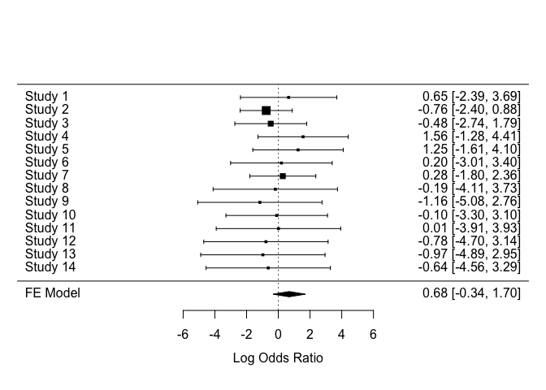

Antidepressants and suicidal behaviour?
================
Jakob A. Kaminski
4 7 2019

Intro
-----

Hengartner et al. performed a re-analysis of the FDA database and evaluated newer-generation antidepressants and suicide risk in Randomized Controlled Trials. We critically review the literature and reanalyze the re-analysis.

This is the data. Of note, there is considerable variance between the studies.

``` r
library(readxl)
for_rma_AD_vs_Placebo <- read_excel("for_rma_AD_vs_Placebo.xlsx")
for_rma_AD_vs_Placebo
```

    ## # A tibble: 14 x 5
    ##    study              ADsuicides ADparticipants PLCsuicides PLCparticipants
    ##    <chr>                   <dbl>          <dbl>       <dbl>           <dbl>
    ##  1 Sertraline (1991)           2           2053           0             786
    ##  2 Paroxetine (1992)           5           2963           2             554
    ##  3 Venlafaxine (1993)          3           2181           1             451
    ##  4 Nefazodone (1994)           9           3496           0             875
    ##  5 Mirtazapine (1996)          8           2425           0             494
    ##  6 Venlafaxine ER (1…          1            705           0             285
    ##  7 Citalopram (1998)           8           4168           1             691
    ##  8 Escitalopram (200…          0            715           0             592
    ##  9 Duloxetine (2002)           0           2314           0             723
    ## 10 Desvenlafaxine (2…          1           2667           0             803
    ## 11 Trazodone ER (201…          0            202           0             204
    ## 12 Vilazodone (2011)           0           2177           0             997
    ## 13 Levomilnacipran (…          0           2655           0            1004
    ## 14 Vortioxetine (201…          0           3060           0            1621

The analysis is run on this data

Reproducing Hengartner et al. results

``` r
library(epitools)
epitab(suicide,pvalue = "midp.exact",oddsratio = "midp", verbose = T, correction = T)
```

    ## $tab
    ##            Placebo           p0 Antidepressant          p1 oddsratio
    ## no suicide   10076 0.9996031746          31744 0.998835782   1.00000
    ## suicide          4 0.0003968254             37 0.001164218   2.83487
    ##               lower    upper    p.value
    ## no suicide       NA       NA         NA
    ## suicide    1.133143 9.671619 0.02354558
    ## 
    ## $measure
    ## [1] "midp"
    ## 
    ## $conf.level
    ## [1] 0.95
    ## 
    ## $pvalue
    ## [1] "midp.exact"
    ## 
    ## $x
    ##            Placebo Antidepressant
    ## no suicide   10076          31744
    ## suicide          4             37
    ## 
    ## $data
    ##            Placebo Antidepressant Total
    ## no suicide   10076          31744 41820
    ## suicide          4             37    41
    ## Total        10080          31781 41861
    ## 
    ## $p.exposed
    ##                 Placebo Antidepressant        Total
    ## no suicide 0.9996031746    0.998835782 0.9990205681
    ## suicide    0.0003968254    0.001164218 0.0009794319
    ## Total      1.0000000000    1.000000000 1.0000000000
    ## 
    ## $p.outcome
    ##               Placebo Antidepressant Total
    ## no suicide 0.24093735      0.7590626     1
    ## suicide    0.09756098      0.9024390     1
    ## Total      0.24079692      0.7592031     1
    ## 
    ## $p.value
    ##             NA
    ## two-sided    midp.exact fisher.exact chi.square
    ##   no suicide         NA           NA         NA
    ##   suicide    0.02354558   0.02855102 0.04960071
    ## 
    ## $correction
    ## [1] TRUE

First one has to visualize the data.

``` r
suicide
```

    ##            Placebo Antidepressant
    ## no suicide   10076          31744
    ## suicide          4             37

Mosaic plot
-----------


Then we reanalyzed the data using meta analytical approach taking the variance between studies into account peto method <http://www.metafor-project.org/doku.php/analyses:yusuf1985>

suicide
=======

    ## Loading required package: Matrix

    ## Loading 'metafor' package (version 2.1-0). For an overview 
    ## and introduction to the package please type: help(metafor).

    ## 
    ##  pred ci.lb ci.ub 
    ##  1.74  0.78  3.90

 \#suicide attempts

    ## 
    ##  pred ci.lb ci.ub 
    ##  1.53  1.09  2.15


suicide
=======

Mantel-Haenszel (MH) Methode. Reccomended for rare events, and anequal group sizes: Ref: <https://ebmh.bmj.com/content/21/2/72>



suicide attempts
================


